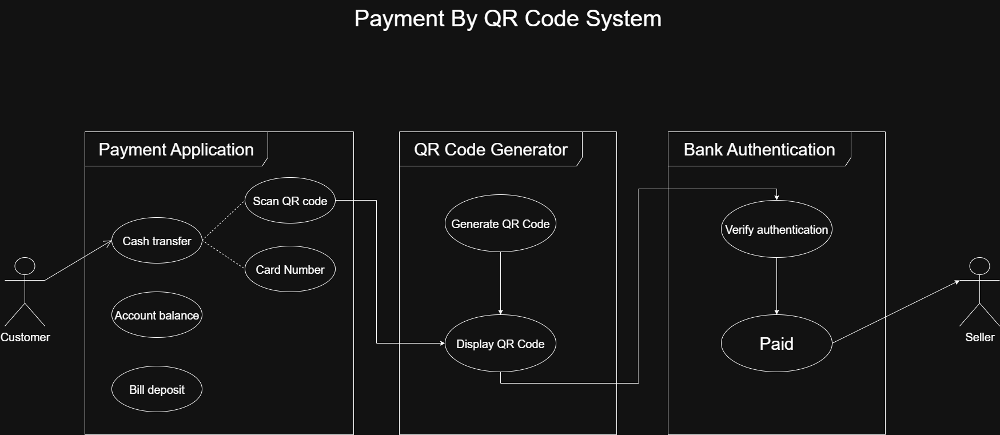

# QR Code Payment Use Case
Academic proje
# سیستم پرداخت با کد QR

این پروژه، نمودار مورد کاربرد (Use Case Diagram) برای یک سیستم پرداخت ساده مبتنی بر کد QR را نمایش می‌دهد. هدف این سیستم، ایجاد یک فرآیند پرداخت سریع و آسان بین مشتری و فروشنده با استفاده از اپلیکیشن پرداخت و تأییدیه بانکی است.

## نمودار Use Case

## شرح اجزای سیستم

این سیستم از سه بخش اصلی و دو بازیگر (Actor) تشکیل شده است:

### بازیگران (Actors)

* **مشتری (Customer):** فردی که فرآیند پرداخت را با استفاده از اپلیکیشن پرداخت آغاز می‌کند.
* **فروشنده (Seller):** فرد یا نهادی که وجه را در پایان تراکنش دریافت می‌کند.

### بخش‌های سیستم (Systems)

1.  **اپلیکیشن پرداخت (Payment Application):**
    این اپلیکیشن، رابط کاربری مشتری برای انجام عملیات مالی است. موارد کاربرد اصلی آن عبارت‌اند از:
    * **Scan QR code:** &nbsp; .ارائه شده توسط فروشنده برای شروع پرداخت QR Code اسکن کردن  
    * **Cash transfer:** &nbsp; .انتقال وجه به حساب مقصد
    * **Card Number:** &nbsp; .امکان استفاده از اطلاعات کارت بانکی برای پرداخت
    * **Account balance:** &nbsp; .مشاهده موجودی حساب
    * **Bill deposit:** &nbsp; .پرداخت قبوض

2.  **تولیدکننده کد QR (QR Code Generator):**
    این بخش مسئولیت ایجاد و ارائه کد QR برای پرداخت را بر عهده دارد.
    * **Generate QR Code:**  &nbsp; .منحصر به فرد که حاوی اطلاعات پرداخت (مانند مبلغ و اطلاعات فروشنده) است QR Codeایجاد یک 
    * **Display QR Code:**  &nbsp;  .تولید شده به مشتری QR Code نمایش
3.  **احراز هویت بانکی (Bank Authentication):**
    این سیستم خارجی مسئولیت پردازش و تأیید نهایی تراکنش را دارد.
    * **Verify authentication:** &nbsp; .بررسی و تأیید اطلاعات پرداخت، هویت مشتری و موجودی حساب
    * **Paid:** &nbsp; .مبلغ با موفقیت پرداخت شد
